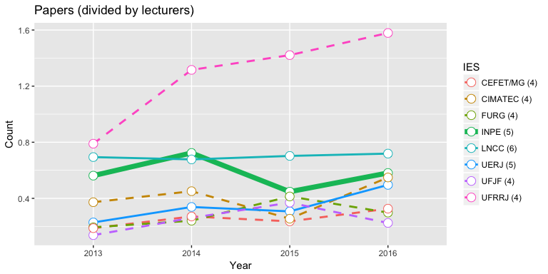
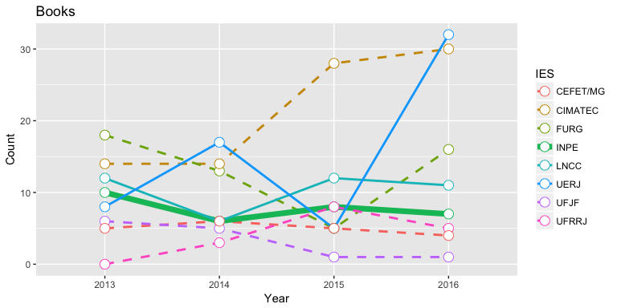
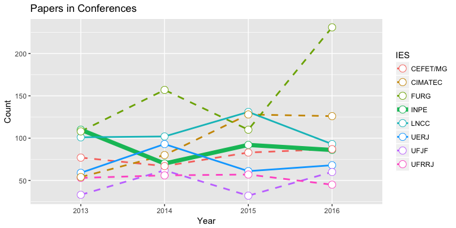
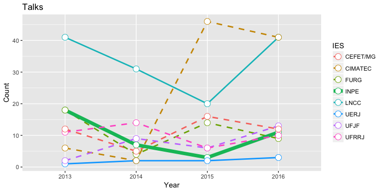
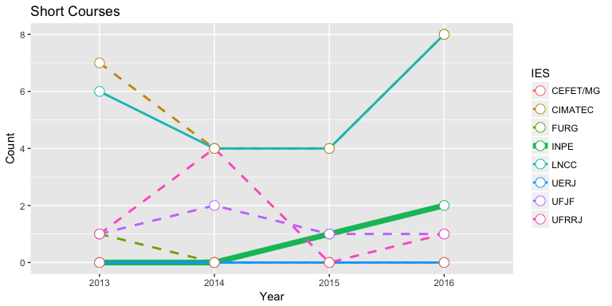
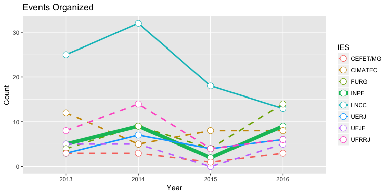

Academic Indicators
================

About
-----

### Reading the data

``` r
indicators <- read.csv(file="../Data/AcademicIndicators.csv", header=TRUE, sep=",", stringsAsFactors=FALSE)
str(indicators)
```

    ## 'data.frame':    8 obs. of  32 variables:
    ##  $ Program          : chr  "COMPUTACAO APLICADA" "MODELAGEM COMPUTACIONAL" "MODELAGEM COMPUTACIONAL" "MODELAGEM COMPUTACIONAL" ...
    ##  $ IES              : chr  "INPE" "LNCC" "UERJ" "UFJF" ...
    ##  $ Full.IES.Name    : chr  "INSTITUTO NACIONAL DE PESQUISAS ESPACIAIS" "LABORATORIO NACIONAL DE COMPUTACAO CIENTIFICA" "UNIVERSIDADE DO ESTADO DO RIO DE JANEIRO" "UNIVERSIDADE FEDERAL DE JUIZ DE FORA" ...
    ##  $ Courses          : chr  "M/D" "M/D" "M/D" "M/D" ...
    ##  $ Grade.in.2013    : int  5 6 5 4 4 4 4 4
    ##  $ PP2013           : int  59 84 29 19 37 15 27 38
    ##  $ PP2014           : int  76 82 43 36 46 25 39 46
    ##  $ PP2015           : int  47 85 39 51 79 27 34 26
    ##  $ PP2016           : int  61 87 63 31 57 30 47 56
    ##  $ BP2013           : int  10 12 8 6 18 0 5 14
    ##  $ BP2014           : int  6 6 17 5 13 3 6 14
    ##  $ BP2015           : int  8 12 5 1 5 8 5 28
    ##  $ BP2016           : int  7 11 32 1 16 5 4 30
    ##  $ CN2013           : int  110 101 59 33 108 53 77 54
    ##  $ CN2014           : int  70 102 93 62 157 56 67 80
    ##  $ CN2015           : int  92 131 61 32 110 57 83 128
    ##  $ CN2016           : int  86 93 68 60 231 45 87 126
    ##  $ TK2013           : int  18 41 1 2 18 11 12 6
    ##  $ TK2014           : int  7 31 2 9 4 14 5 2
    ##  $ TK2015           : int  3 20 2 6 14 6 16 46
    ##  $ TK2016           : int  11 41 3 13 9 10 12 41
    ##  $ SC2013           : int  0 6 0 1 1 1 0 7
    ##  $ SC2014           : int  0 4 0 2 0 4 0 4
    ##  $ SC2015           : int  1 4 0 1 0 0 0 4
    ##  $ SC2016           : int  2 8 0 1 0 1 0 8
    ##  $ EO2013           : int  5 25 3 5 4 8 3 12
    ##  $ EO2014           : int  9 32 7 5 9 14 3 5
    ##  $ EO2015           : int  2 18 4 0 4 4 1 8
    ##  $ EO2016           : int  9 13 6 5 14 6 3 8
    ##  $ Lecturers2016    : int  30 46 23 28 21 22 27 17
    ##  $ Students2016     : int  105 121 127 138 191 19 144 102
    ##  $ Collaborators2016: int  159 274 155 127 280 103 249 115

### Subsetting and melting the data - Why and How

``` r
# Get only the columns we need
subset <- subset(indicators, select = c(IES,PP2013,PP2014,PP2015,PP2016))
# Change labels on the columns
colnames(subset) <- c("IES",2013,2014,2015,2016)
meltedsubset <- melt(subset, id.vars="IES", value.name="Count", variable.name="Year")
meltedsubset
```

    ##         IES Year Count
    ## 1      INPE 2013    59
    ## 2      LNCC 2013    84
    ## 3      UERJ 2013    29
    ## 4      UFJF 2013    19
    ## 5      FURG 2013    37
    ## 6     UFRRJ 2013    15
    ## 7  CEFET/MG 2013    27
    ## 8   CIMATEC 2013    38
    ## 9      INPE 2014    76
    ## 10     LNCC 2014    82
    ## 11     UERJ 2014    43
    ## 12     UFJF 2014    36
    ## 13     FURG 2014    46
    ## 14    UFRRJ 2014    25
    ## 15 CEFET/MG 2014    39
    ## 16  CIMATEC 2014    46
    ## 17     INPE 2015    47
    ## 18     LNCC 2015    85
    ## 19     UERJ 2015    39
    ## 20     UFJF 2015    51
    ## 21     FURG 2015    79
    ## 22    UFRRJ 2015    27
    ## 23 CEFET/MG 2015    34
    ## 24  CIMATEC 2015    26
    ## 25     INPE 2016    61
    ## 26     LNCC 2016    87
    ## 27     UERJ 2016    63
    ## 28     UFJF 2016    31
    ## 29     FURG 2016    57
    ## 30    UFRRJ 2016    30
    ## 31 CEFET/MG 2016    47
    ## 32  CIMATEC 2016    56

### Setting up some layers and lists for ggplot

<https://stackoverflow.com/questions/18747091/reuse-ggplot-layers-in-multiple-plots>

``` r
lthick <- c(1,1,1,2.5,1,1,1,1)
lstyle <- c("dashed","dashed","dashed","solid","solid","solid","dashed","dashed")
mygglayers = list(
    geom_line(aes(size=IES,linetype=IES)),
    geom_point(size=4, shape=21, fill="white"),
    scale_size_manual(values = lthick),
    scale_linetype_manual(values = lstyle)
)
```

How many papers were published?
-------------------------------

### Preprocessing and reshaping the data

``` r
# Get only the columns we need
subset <- subset(indicators, select = c(IES,PP2013,PP2014,PP2015,PP2016))
# Change labels on the columns
colnames(subset) <- c("IES",2013,2014,2015,2016)
# Annotating the IES names with the grade in the last evaluation 
subset$IES = paste(subset$IES," (",indicators$Grade.in.2013,")",sep = "")
meltedsubset <- melt(subset, id.vars="IES", value.name="Count", variable.name="Year")
```

The Plot
--------

``` r
ggplot(data=meltedsubset, aes(x=Year, y=Count, group = IES, colour = IES)) +
    ggtitle("Papers") +
    mygglayers
```


Adjusting for number of lecturers
---------------------------------

<https://stackoverflow.com/questions/39563283/r-divide-some-columns-of-a-data-frame-and-keeping-the-others>

``` r
subset[,-1] = subset[,-1] / indicators[,c('Students2016')]
#subset[,-1] = subset[,-1] / indicators[,c('Lecturers2016')]
subset
```

    ##            IES      2013      2014      2015      2016
    ## 1     INPE (5) 0.5619048 0.7238095 0.4476190 0.5809524
    ## 2     LNCC (6) 0.6942149 0.6776860 0.7024793 0.7190083
    ## 3     UERJ (5) 0.2283465 0.3385827 0.3070866 0.4960630
    ## 4     UFJF (4) 0.1376812 0.2608696 0.3695652 0.2246377
    ## 5     FURG (4) 0.1937173 0.2408377 0.4136126 0.2984293
    ## 6    UFRRJ (4) 0.7894737 1.3157895 1.4210526 1.5789474
    ## 7 CEFET/MG (4) 0.1875000 0.2708333 0.2361111 0.3263889
    ## 8  CIMATEC (4) 0.3725490 0.4509804 0.2549020 0.5490196

``` r
meltedsubset <- melt(subset, id.vars="IES", value.name="Count", variable.name="Year")
ggplot(data=meltedsubset, aes(x=Year, y=Count, group = IES, colour = IES)) +
    ggtitle("Papers (divided by lecturers)") +
    mygglayers
```



How many books were published?
------------------------------

### Preprocessing and reshaping the data

``` r
# Get only the columns we need
subset <- subset(indicators, select = c(IES,BP2013,BP2014,BP2015,BP2016))
# Change labels on the columns
colnames(subset) <- c("IES",2013,2014,2015,2016)
meltedsubset <- melt(subset, id.vars="IES", value.name="Count", variable.name="Year")
```

``` r
ggplot(data=meltedsubset, aes(x=Year, y=Count, group = IES, colour = IES)) +
    ggtitle("Books") +
    mygglayers
```



How many papers in conferences?
-------------------------------

### Preprocessing and reshaping the data

``` r
# Get only the columns we need
subset <- subset(indicators, select = c(IES,CN2013,CN2014,CN2015,CN2016))
# Change labels on the columns
colnames(subset) <- c("IES",2013,2014,2015,2016)
meltedsubset <- melt(subset, id.vars="IES", value.name="Count", variable.name="Year")
```

``` r
ggplot(data=meltedsubset, aes(x=Year, y=Count, group = IES, colour = IES)) +
    ggtitle("Papers in Conferences") +
    mygglayers
```



How many talks?
---------------

### Preprocessing and reshaping the data

``` r
# Get only the columns we need
subset <- subset(indicators, select = c(IES,TK2013,TK2014,TK2015,TK2016))
# Change labels on the columns
colnames(subset) <- c("IES",2013,2014,2015,2016)
meltedsubset <- melt(subset, id.vars="IES", value.name="Count", variable.name="Year")
```

``` r
ggplot(data=meltedsubset, aes(x=Year, y=Count, group = IES, colour = IES)) +
    ggtitle("Talks") +
    mygglayers
```



How many short courses?
-----------------------

### Preprocessing and reshaping the data

``` r
# Get only the columns we need
subset <- subset(indicators, select = c(IES,SC2013,SC2014,SC2015,SC2016))
# Change labels on the columns
colnames(subset) <- c("IES",2013,2014,2015,2016)
meltedsubset <- melt(subset, id.vars="IES", value.name="Count", variable.name="Year")
```

``` r
ggplot(data=meltedsubset, aes(x=Year, y=Count, group = IES, colour = IES)) +
    ggtitle("Short Courses") +
    mygglayers
```



How many events were organized?
-------------------------------

### Preprocessing and reshaping the data

``` r
# Get only the columns we need
subset <- subset(indicators, select = c(IES,EO2013,EO2014,EO2015,EO2016))
# Change labels on the columns
colnames(subset) <- c("IES",2013,2014,2015,2016)
meltedsubset <- melt(subset, id.vars="IES", value.name="Count", variable.name="Year")
```

``` r
ggplot(data=meltedsubset, aes(x=Year, y=Count, group = IES, colour = IES)) +
    ggtitle("Events Organized") +
    mygglayers
```



References
----------

(from <https://stackoverflow.com/questions/17150183/plot-multiple-lines-in-one-graph>) <https://stackoverflow.com/questions/27350243/ggplot-line-graph-with-different-line-styles-and-markers> <https://stackoverflow.com/questions/17996410/ggplot-specific-thick-line>

labels:; factor order <http://rstudio-pubs-static.s3.amazonaws.com/7433_4537ea5073dc4162950abb715f513469.html>
